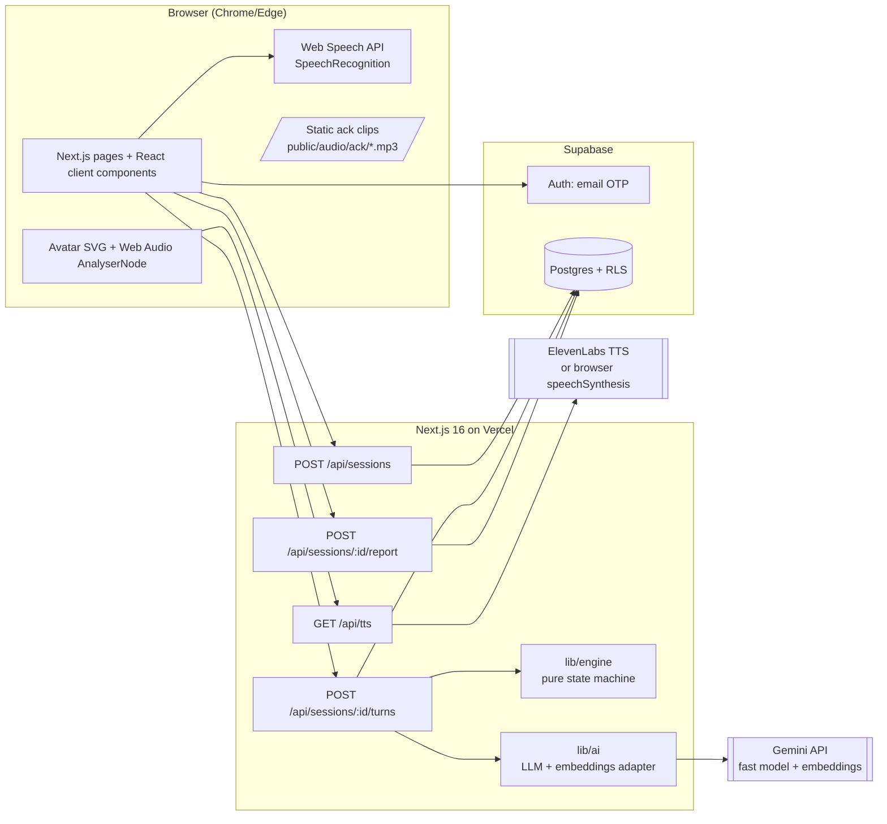

# Technical Design Document: JobMe MVP

## Executive Summary

**System:** JobMe, an adaptive voice mock interview
**Version:** MVP 1.0 · **Architecture:** single Next.js 16 app (App Router + Route Handlers) on Vercel, with Supabase for Auth and Postgres
**Effort:** one solo developer, 24-hour sprint · **Budget:** $0–$10
**Base repo:** [`maxMyers13/hackathon-app`](https://github.com/maxMyers13/hackathon-app) · **Process:** [`challengepost/learn-ai-basics`](https://github.com/challengepost/learn-ai-basics) skills 1→6

> **Learn Skill Pack mapping.** The headings **How This Works, In Plain Language**, **The Core Journey Through the System**, **Stack**, **Where It Runs and How Someone Tries It**, **Look and Feel**, **Components**, **Data Model**, **File Structure**, **External Services and Dependencies**, **Important Failure Modes**, **What Was Simplified and Why**, and **Decisions and Open Issues** match `skills/4-spec/templates/spec-template.md`. Use this document as your answers in the `4-spec` interview so `devpost/spec.md` matches it. The **Build Plan** section is written in `5-build` slice format.

### Key change from the brief
The brief assumed **React + Vite + FastAPI + Railway**. The required skeleton is **Next.js 16 + Supabase** with no Python service. Everything the brief put in FastAPI (state machine, evaluator, validation, TTS proxy) moves into **Next.js Route Handlers**, and Pydantic becomes **Zod**. The result is one repo, one deploy, and one set of env vars. Nothing in the kernel is lost.

---

## Hackathon Compliance (read before writing any code)

The rules require three things. (1) A **new project, started from an empty folder during the submission period**. (2) The project must be **built with the skills**. (3) **`scope.md`, `prd.md`, `spec.md`** must be in the public repo. Also, `1-start` **stops** if the folder already contains an unrelated project.

**Recommended sequence**
1. `mkdir jobme && cd jobme && git init`, then `npx skills add challengepost/learn-ai-basics --all -y`.
2. Run `1-start` → `2-scope` → `3-prd` → `4-spec`, using the PRD and this document as your answers. When `4-spec` asks about stack, name the hackathon-app starter.
3. In **`5-build` slice 1**, bring the starter in: `git remote add starter https://github.com/maxMyers13/hackathon-app && git fetch starter && git checkout starter/main -- .` (or copy the files). Remove the `todos` demo and commit it as part of the first working slice.
4. The git history then shows an empty start, the skills' planning docs, and the starter introduced as a chosen dependency, not pre-existing code.

> If an organizer has said explicitly that the starter repo is allowed as a template, you can instead click **Use this template** and run the skills inside it. Tell `1-start` the starter is intentional. **Confirm this with the organizers in Discord.** It is Open Question #1.

---

## How This Works, In Plain Language

JobMe is one Next.js website with a small server side built in, and Supabase as its database and sign-in.

- The **browser** does the hearing and speaking. Chrome's built-in speech recognition turns your voice into text while you hold the talk button. An `<audio>` element plays the recruiter's voice, and a drawn (SVG) recruiter moves its mouth in time with the audio.
- When you submit an answer, the browser sends the **text** (never audio) to the app's server route `/api/sessions/[id]/turns`. That route does four things:
  1. Asks a fast AI model to **score** the answer on five dimensions and **draft** two possible follow-ups, one digging deeper and one asking for missing context.
  2. Runs a **deterministic state machine** (plain TypeScript, no AI) that reads the scores and decides the next move: Deepen, Clarify, next topic, or wrap up.
  3. Saves the result to Supabase.
  4. Returns the scores, the notepad text, and the next question.
- The browser shows the notepad right away and asks `/api/tts` to turn the question into speech. That route calls the voice provider using a secret key the browser never sees.
- The **scorecard** is generated once at the end by one more AI call (summary plus a rewrite of your weakest answer) and saved, so it loads instantly afterward.

**Why this shape:** the AI never runs the interview. It only grades and phrases. That makes every session bounded (4–10 questions), testable with scripted answers, and demo-safe.

---

## Architecture Overview



---

## The Core Journey Through the System
*(PRD ref: `prd.md > The Core Journey`)*

1. **Sign in.** `/login` (starter) calls `supabase.auth.signInWithOtp` then `verifyOtp`. A session cookie is set, and `src/proxy.ts` refreshes it on every request. A DB trigger creates the `profiles` row.
2. **Dashboard.** `app/dashboard/page.tsx` is a Server Component. It uses `createClient()` from `lib/supabase/server` to read `interview_sessions` (RLS scopes the rows to the user) and renders the list plus a `<TrendChart>` client component.
3. **Setup.** `app/interview/new` has a client form and a mic check (`getUserMedia` + AnalyserNode meter). **Begin** calls `POST /api/sessions` with `{displayName, roleText}`. The server updates the profile, picks 4 of 5 topics (shuffled), builds the initial `EngineState`, inserts `interview_sessions`, and returns `{sessionId, introLine, question}`. The client routes to `/interview/[id]`.
4. **Room load.** `app/interview/[id]/page.tsx` (server) loads the session and its turns. If `status = completed` it redirects to the report. Otherwise it passes the current question and notepad history to `<InterviewRoom>` (client), which makes refresh-resume free.
5. **Ask.** The client calls `speak(question)`. `<audio src="/api/tts?text=…">` streams MP3 from the TTS proxy, the AnalyserNode drives the mouth, and the captions show the text. On error it falls back to `speechSynthesis`.
6. **Answer.** Holding Space or the button starts `SpeechRecognition` (`interimResults: true`, `continuous: true`) and records `startedAt`. Release stops it and shows the final transcript with Submit / Re-record.
7. **Submit.** The client plays a random ack clip immediately, then calls `POST /api/sessions/[id]/turns` with `{transcript, durationMs, clientTurnSeq}`.
8. **Turn route (server):**
   1. Auth check, then load `engine_state` from `interview_sessions`.
   2. If `transcript` has fewer than 5 words, return a `nudge` (no scoring, no cap increment).
   3. `Promise.all([evaluateAndDraft(...), embed(answer)])`. This is **one LLM call** plus one embedding call, run in parallel.
   4. Compute the relevance similarity and the anchor check, then `classifyBand()`.
   5. `engine.step(state, evaluation)` returns `{nextState, move, nextQuestion}`.
   6. `UPDATE interview_sessions SET engine_state, question_count` (synchronous, the source of truth).
   7. Return `{notepad, move, nextQuestion, done}`.
   8. `after()` inserts the `turns` row (non-blocking).
9. **React.** The client renders the notepad entry and then speaks `nextQuestion`. If `done`, it speaks the wrap line and routes to `/interview/[id]/report`.
10. **Scorecard.** The page (server) reads `reports`. If none exists, the client calls `POST /api/sessions/[id]/report`, which generates the summary and weakest-answer rewrite (1 LLM call), inserts `reports`, sets the session to `completed`, and fills `overall_scores`.
11. **Return.** The dashboard re-reads the sessions, and the trends include the new session.

---

## Stack

| Layer | Choice | Version / notes | Why | Docs |
|---|---|---|---|---|
| Framework | **Next.js App Router** | `16.3.5` (pinned by starter) | Required skeleton. UI and server routes in one app | [nextjs.org/docs](https://nextjs.org/docs) |
| Language | TypeScript | `^5` | Starter default | [typescriptlang.org](https://www.typescriptlang.org/docs/) |
| UI | React 19 + **Tailwind CSS v4** | starter | Starter default | [tailwindcss.com/docs](https://tailwindcss.com/docs) |
| Components | **shadcn/ui** (Button, Card, Dialog, Badge, Progress, Textarea, Tooltip) | add via `npx shadcn@latest init` | Your usual kit. Supports Tailwind v4 + React 19 (verify at init) | [ui.shadcn.com](https://ui.shadcn.com/docs) |
| Charts | **Recharts** (trend line chart only) | `^3` | Fastest way to get 5 labeled series. Verify React 19 peer deps at install | [recharts.org](https://recharts.org) |
| Auth + DB | **Supabase** via `@supabase/ssr` + `@supabase/supabase-js` | starter | Email OTP, Postgres, RLS | [supabase.com/docs](https://supabase.com/docs) |
| Validation | **Zod** | `^3` or `^4` | Replaces Pydantic. Validates LLM JSON and request bodies | [zod.dev](https://zod.dev) |
| LLM + embeddings | **Google Gemini API** via `@google/genai` | fast Flash-class model, `gemini-embedding-001` | Free tier, JSON-schema output, one key for both | [ai.google.dev/gemini-api/docs](https://ai.google.dev/gemini-api/docs) |
| TTS | **ElevenLabs** streaming (`eleven_flash_v2_5`) with **browser `speechSynthesis`** fallback | REST, no SDK needed | Low-latency streaming, free tier. Fallback is free and always there | [elevenlabs.io/docs](https://elevenlabs.io/docs) |
| STT | **Web Speech API** (`SpeechRecognition`) | Chrome/Edge | Free, streaming interim results | [MDN](https://developer.mozilla.org/docs/Web/API/SpeechRecognition) |
| Avatar | Inline **SVG React component** + **Web Audio `AnalyserNode`** | none | Free, zero-latency lip-flap | [MDN AnalyserNode](https://developer.mozilla.org/docs/Web/API/AnalyserNode) |
| Hosting | **Vercel** | Hobby | Built for Next.js. The starter README recommends it | [vercel.com/docs](https://vercel.com/docs) |

### Alternatives considered

| Decision | Chosen | Alternative | Why not (for this sprint) |
|---|---|---|---|
| Backend | Next.js Route Handlers | FastAPI on Railway (brief) | A second service, second deploy, CORS, and Supabase JWT verification in Python. Costs hours and proves nothing extra |
| LLM | Gemini Flash-class (free tier) | Claude Haiku 4.5 / OpenAI mini-class | Both are strong and fast, but paid. **Trade-off:** Gemini's *free* tier may use prompts to improve Google products. Acceptable for a demo; switch to a paid tier or another provider before real users. The adapter keeps this a one-file change |
| TTS | ElevenLabs Flash + browser fallback | OpenAI `gpt-4o-mini-tts` | Paid per use. Browser-only voice is weaker on Design |
| STT | Web Speech API + typed fallback | Whisper-class API | Adds upload, latency, and cost. Typed fallback keeps the product complete |
| Engine state | `engine_state` jsonb in Postgres | In-memory (brief) | Vercel functions are stateless. Memory does not survive between requests |

**Verify early (hour 1):** current Gemini model IDs and free-tier limits, ElevenLabs free-tier credits, and `after()` plus route-handler `params` behavior in **Next.js 16**. The starter's `AGENTS.md` warns that this Next.js version has breaking changes, so read `node_modules/next/dist/docs/` before writing routes.

---

## Where It Runs and How Someone Tries It

- **Runtime:** browser (Chrome/Edge desktop) plus Next.js server functions. Requires Node 20+.
- **Env vars** (`.env.local`, never committed. Add all but the Supabase URL and anon key to `.env.example` as blank keys):

```
NEXT_PUBLIC_SUPABASE_URL=
NEXT_PUBLIC_SUPABASE_ANON_KEY=
SUPABASE_SERVICE_ROLE_KEY=        # starter; not used by JobMe routes (RLS path only)
GEMINI_API_KEY=
LLM_MODEL=gemini-2.5-flash        # verify current fast model ID; keep "thinking" off
EMBED_MODEL=gemini-embedding-001
TTS_PROVIDER=browser              # browser | elevenlabs  (use elevenlabs for demo takes only)
ELEVENLABS_API_KEY=
ELEVENLABS_VOICE_ID=
```

- **Local:** `npm install` → Supabase setup per the starter README (steps 2–4) → `npx supabase db push --linked` → `npm run dev` → open `http://localhost:3000` **in Chrome**.
- **Deploy (optional, recommended for the video):** import the repo on Vercel and set the same env vars. The Supabase Auth → URL config needs the Vercel domain added to redirect URLs.
- **Demo recording:** set `TTS_PROVIDER=elevenlabs`. Record with OBS, capturing **system audio + mic** so the recruiter's voice is in the video. Follow the brief's 90-second script. The weak answer is "We worked as a team and fixed the bug." The strong answer is a STAR answer with a number.
- **Submission:** public GitHub repo containing `devpost/scope.md`, `prd.md`, `spec.md`, plus a 1–3 minute video.

---

## Look and Feel
*(from `prd.md > Look and Feel`, proposed direction to confirm)*

- **Tokens** go in `globals.css` via Tailwind v4 `@theme`: `--color-bg: #FAF8F5` (warm off-white), `--color-ink: #1C1B1A`, `--color-accent: #0F766E` (teal-700), `--color-muted: #6B6660`. Score colors: `1 #B42318`, `2 #B54708`, `3 #A16207`, `4 #15803D`. Every score renders as a **bar plus a number**.
- **Type:** Geist Sans (UI, already in the starter), Geist Mono (notepad evidence quotes).
- **Density:** spacious in the interview room (one focal point, the avatar and question). Dense and scannable on the notepad and scorecard.
- **Copy tone:** a warm, direct recruiter. Notepad lines are terse, in the style "No measurable result → asking for impact."
- **Motion:** avatar blink every 3–6 s at random. Nod on listening start. Mouth open amount = smoothed RMS from the AnalyserNode. Respect `prefers-reduced-motion` (mouth only, no nod).
- **Avoid:** chat bubbles, purple gradients, raw JSON.

---

## Components

### Auth and Profile
Starter `login/`, `logout/`, and `lib/supabase/*` stay unchanged. Add `requireUser()` in `lib/auth.ts` (server). It calls `getUser()` and `redirect('/login')` when there is no user, and every protected page and route uses it. Routes return `401` JSON instead of redirecting.
PRD ref: `prd.md > Accounts and Profile`.

### Dashboard
`app/dashboard/page.tsx` (server) holds the session list and **Start interview**. `components/dashboard/TrendChart.tsx` (client, Recharts) plots the 5 dimension averages per completed session in chronological order. `components/dashboard/SessionRow.tsx` has Resume / View / Delete, and delete calls `DELETE /api/sessions/[id]` then `router.refresh()`.
PRD ref: `prd.md > Dashboard and Progress`.

### Interview Setup
`app/interview/new/page.tsx` (server shell) wraps `SetupForm.tsx` (client). It contains `MicCheck.tsx` (a `getUserMedia` level meter) and a speech-support probe (`'webkitSpeechRecognition' in window || 'SpeechRecognition' in window`). If there's no support or permission, it sets `inputMode = 'typed'`, which is passed as a query param to the room.
PRD ref: `prd.md > Interview Setup`.

### Interview Room (client orchestrator)
`components/room/InterviewRoom.tsx` owns a small client phase machine:
`speaking → awaitingAnswer → recording → reviewing → submitting → speaking … → done`.
Children:
- `Avatar.tsx`: SVG with props `{state: 'idle'|'listening'|'thinking'|'speaking', mouth: 0..1}`.
- `Captions.tsx`: the current question text.
- `PushToTalk.tsx`: pointer and Space key handling (ignores key repeat and Space while focus is in a textarea), plus a typed-mode textarea.
- `LiveTranscript.tsx`: interim (grey) and final (ink) text.
- `Notepad.tsx`: the current entry plus collapsible history.
- `ProgressPill.tsx`: "Topic 2 of 4 · Q5".
- **End early** opens a confirm dialog, then `POST /api/sessions/[id]/report`.

PRD ref: `prd.md > Interview Room: Voice Loop`, `prd.md > Recruiter's Notepad`.

### Speech Input (`lib/voice/stt.ts`)
A wrapper around `SpeechRecognition`: `start(onInterim, onFinal)` and `stop(): Promise<string>`. `continuous: true`, `interimResults: true`, `lang: 'en-US'`. Chrome ends recognition after silence, so the wrapper **auto-restarts** while the key is still held and concatenates the finals. It returns the text and `durationMs` (hold time).

### Voice Output (`lib/voice/tts.ts` + `/api/tts`)
- `speak(text): Promise<void>`. If `TTS_PROVIDER=elevenlabs`, it sets a shared `<audio>` element's `src` to `/api/tts?text=<encoded>`, plays it, and resolves on `ended`. On `error` or a 4 s stall it falls back. The fallback is `speechSynthesis.speak(new SpeechSynthesisUtterance(text))`, with the mouth driven by a sine oscillation while `speaking`, because an utterance has no audio stream to analyze.
- One `AudioContext` is created on the **Begin** click, which satisfies the browser's user-gesture rule. `createMediaElementSource(audio)` → `AnalyserNode` → `destination`. A `requestAnimationFrame` loop computes RMS and passes it to the `mouth` prop.
- `playAck()` picks one of `public/audio/ack/ack-01..10.mp3` at random. These are pre-generated once with `scripts/gen-ack-clips.ts` in the same voice.
- `/api/tts` route: requires a user, caps `text` at 600 chars, calls the ElevenLabs stream endpoint, and pipes the response body straight through with `Content-Type: audio/mpeg`. Because it's same-origin, the AnalyserNode works without CORS.

### Turn API (`app/api/sessions/[id]/turns/route.ts`)
Steps as in the Core Journey, step 8. Request schema: `{transcript: string (1..5000), durationMs: int, clientTurnSeq: int}`. `clientTurnSeq` must equal `state.turnSeq + 1`, otherwise the route returns `409` with the current state. This makes double-submits idempotent. The response is described under **API Contracts**.
PRD ref: `prd.md > Adaptive Engine`.

### Evaluator (`lib/ai/evaluate.ts`)
One call: `evaluateAndDraft({topic, questionText, questionType, answer, roleText, difficulty, priorThreadTurns})`, which returns `Evaluation`, validated with Zod. The system prompt contains the 5-dimension rubric with 1/2/3/4 anchors per dimension, the rules ("quote evidence **verbatim** from the answer, ≤ 20 words", "drafts must reference the candidate's own words, ≤ 30 words, one question each", "never invent facts about the candidate"), and 1 weak and 1 strong few-shot example. Settings: `responseMimeType: 'application/json'` + `responseSchema`, temperature 0.2, thinking disabled or minimal for latency (verify the config key for the chosen model). On a Zod failure it retries once. If that fails too it throws `EvalError`, and the route falls back to a seed Clarify.
PRD ref: `prd.md > Adaptive Engine`, `prd.md > Recruiter's Notepad`.

### Adaptive Engine (`lib/engine/*`, pure TypeScript, unit-tested)
- `bank.ts`: 5 topics. Each has `opening` (L1), `harder` (L2), `hardest` (L3), `seeds.deepen[3]`, `seeds.clarify[dimension][1–2]`, and exemplars `{weak, strong}`.
- `classify.ts`: `classifyBand(scores, offTopic, anchor)`. **Order of checks:**
  1. `offTopic || avg < 2.0` → `weak`
  2. `avg >= 3.5 && min >= 3` → `great`
  3. otherwise → `mediocre`
  4. **Anchor downgrade:** if the band is `great` but `simWeak - simStrong > 0.05`, downgrade to `mediocre` (the conservative probe).
- `policy.ts`: `step(state, evaluation) → {state, move, question}`
  - **Resolve topic if:** `followUpsUsed === 2`; **or** (this is a follow-up **and** no dimension rose ≥ 1 vs. the previous answer in the thread); **or** (the last move was `deepen` **and** band = `great`); **or** (the last move was `clarify` after a `weak` **and** band = `weak`).
  - **Not resolved:** `great` → `deepen` (use `drafts.deepen`, falling back to a seed). `mediocre` or `weak` → `clarify` aimed at `primary_gap` (use `drafts.clarify`, falling back to `seeds.clarify[primary_gap]`).
  - **Resolved:** if the thread's final band is `great`, `difficulty = min(3, difficulty + 1)`. Advance to the next topic and ask its opening at the current difficulty. If there are no topics left **or** `questionCount >= 10`, the move is `wrap`.
  - The hard cap is checked **before** any follow-up is issued: if `questionCount >= 10`, wrap.
- `types.ts`: `EngineState`, `Move`, `Band`, `Dimension`.
- `notepad.ts`: `reasonLine(move, gap, band)` builds deterministic reason text, e.g. `impact` + `clarify` → "No measurable result → asking for impact". The LLM's `notepad_text` is used as the observation line. The reason line is always deterministic, so it matches the actual move.

PRD ref: `prd.md > Adaptive Engine`.

### Embedding Checks (`lib/ai/embeddings.ts`)
- `data/bank-embeddings.json` is **precomputed** by `scripts/embed-bank.ts` (~15 question texts + 10 exemplars) and committed, so there are no cold-start calls on Vercel.
- Per turn: embed the answer (in parallel with the LLM call). Take the cosine against the current question's vector for the **relevance signal**. Final Relevance = `round((llmRelevance + simToScore(sim)) / 2)`, where the `simToScore` thresholds are **calibrated in hour 1** on the exemplars (start with `<0.55→1, <0.65→2, <0.75→3, else 4`).
- Anchor check: cosine vs. this topic's weak and strong exemplars (feeds `classifyBand`).
- **P1:** repeat avoidance. When choosing the next topic, skip one whose opening has cosine > 0.85 to any prior answer. This needs no new data.

### Report Generator (`lib/ai/report.ts` + `app/api/sessions/[id]/report/route.ts`)
Idempotent: if a `reports` row exists, return it. Otherwise:
1. Pick the weakest turn (lowest average, ties go to the earliest).
2. One LLM call returns `{summary (≤ 80 words), rewrite (STAR, ≤ 170 words, uses only the candidate's facts, "[metric]" placeholders where missing)}`.
3. Compute `overall_scores` (per-dimension average), overall WPM, and filler count **in code**.
4. Insert the report, then update the session to `completed` with `ended_at` and `overall_scores`.

If the LLM fails, save the report with the rewrite set to `null`, and the UI shows "Rewrite unavailable — try again" with a retry button.
PRD ref: `prd.md > Scorecard`.

### Scorecard Page
`app/interview/[id]/report/page.tsx` (server) loads the session, turns, and report. `ScoreTable.tsx` shows the per-question table. `HighlightedTranscript.tsx` finds each turn's `evidence` in `answer_transcript` (case-insensitive) and wraps it in `<mark>` with the gap tag. If no match is found, it shows the quote beneath the answer instead. `SpeakingStats.tsx` and `RewriteCard.tsx` complete the page.

### Speaking Stats (`lib/stats.ts`)
- `wpm = words / (durationMs / 60000)`, rounded. Hold time includes pauses, which is fine for the MVP.
- `fillerCount` uses a regex over `\b(um+|uh+|erm|like|you know|basically|actually|kind of|sort of|i mean)\b`. It's labeled "approximate", because Chrome STT often drops "um/uh".

---

## Data Model

Migration `supabase/migrations/<ts>_jobme_schema.sql`. **Delete** the starter's `create_todos.sql` and its usage in `page.tsx`.

| Table | Columns (key) | Notes |
|---|---|---|
| `profiles` | `id uuid PK → auth.users(id) on delete cascade`, `display_name text`, `target_role text`, `created_at timestamptz default now()` | Created by trigger `on_auth_user_created` (`security definer`), with `display_name` defaulting to the email local part |
| `interview_sessions` | `id uuid PK default gen_random_uuid()`, `user_id uuid not null default auth.uid() → auth.users`, `track text default 'behavioral_swe_intern'`, `role_text text`, `status text check in ('in_progress','completed') default 'in_progress'`, `question_count int default 0`, `engine_state jsonb not null`, `overall_scores jsonb`, `started_at timestamptz default now()`, `ended_at timestamptz` | `engine_state` is the live source of truth (added vs. brief). Index `(user_id, started_at desc)` |
| `turns` | `id uuid PK`, `session_id uuid → interview_sessions on delete cascade`, `user_id uuid not null default auth.uid()`, `seq int`, `topic text`, `question_type text check in ('opening','deepen','clarify')`, `difficulty int`, `question_text text`, `answer_transcript text`, `scores jsonb` (null = unscored), `band text`, `primary_gap text`, `evidence text`, `notepad_text text`, `reason_text text`, `wpm int`, `filler_count int`, `created_at timestamptz default now()` | `unique(session_id, seq)` prevents duplicate turns |
| `reports` | `session_id uuid PK → interview_sessions on delete cascade`, `user_id uuid not null default auth.uid()`, `summary text`, `weakest_turn_id uuid → turns`, `rewrite_text text`, `stats jsonb` (`{wpm, fillers}`), `created_at timestamptz default now()` | Generated once |

**RLS:** enable it on all four tables. Policies `to authenticated` for `select/insert/update/delete` use `(select auth.uid()) = user_id` (on `profiles`: `= id`). **No public policies.** API routes use the cookie-based server client, so RLS applies automatically. The service-role key is **not** used anywhere in JobMe.

**`EngineState` (jsonb):**
```ts
{
  topics: TopicId[4];          // chosen order
  topicIndex: number;          // 0..3
  difficulty: 1 | 2 | 3;
  followUpsUsed: 0 | 1 | 2;    // in current thread
  lastMove: 'opening' | 'deepen' | 'clarify';
  lastBand: Band | null;
  threadScores: Scores[];      // answers in current thread, for plateau check
  questionCount: number;       // scored questions asked (cap 10)
  turnSeq: number;             // answered turns (idempotency)
  currentQuestion: { text: string; type: QuestionType; topic: TopicId; difficulty: number };
  askedQuestions: string[];    // for P1 repeat avoidance
  done: boolean;
}
```

**Where data lives, and what happens on return:**
- Session and engine state are in Postgres and are updated on every turn. A refresh reloads them from there.
- Turns are in Postgres, written after the response via `after()`. The notepad history rebuilds from them.
- Transcript text in progress lives only in React state. A refresh mid-answer loses that one answer, which is acceptable.
- Audio is never persisted.

---

## API Contracts (internal)

| Method + path | Request | Response | Errors |
|---|---|---|---|
| `POST /api/sessions` | `{displayName: string(1..40), roleText?: string(..2000)}` | `{sessionId, introLine, question: {text, type:'opening', topic, difficulty}, progress:{topicIndex, topicsTotal:4, questionCount}}` | 401, 422 |
| `POST /api/sessions/[id]/turns` | `{transcript, durationMs, clientTurnSeq}` | `{kind:'nudge', line}` **or** `{kind:'turn', notepad:{seq, topic, questionType, scores, band, primaryGap, evidence, observation, reason}, next:{text, type, topic, difficulty} \| null, done: boolean, wrapLine?: string, progress}` | 401, 404, 409 (stale seq, body has current state), 422 |
| `POST /api/sessions/[id]/report` | none | `{summary, weakestTurnId, rewrite \| null, stats, overallScores}` | 401, 404 |
| `DELETE /api/sessions/[id]` | none | `204` | 401, 404 |
| `GET /api/tts?text=` | query `text ≤ 600 chars` | `audio/mpeg` stream | 401, 413, 502 (client falls back) |

In Next 16, dynamic route `params` is a **Promise**: `const { id } = await ctx.params`. Use the generated `RouteContext<'/api/sessions/[id]/turns'>` type if available. Verify in `node_modules/next/dist/docs`.

**`Evaluation` Zod schema (LLM output):**
```ts
const Score = z.number().int().min(1).max(4);
export const Evaluation = z.object({
  scores: z.object({ structure: Score, specificity: Score, impact: Score, ownership: Score, relevance: Score }),
  primary_gap: z.enum(['structure','specificity','impact','ownership','relevance']),
  evidence: z.string().max(200),          // verbatim quote
  observation: z.string().max(90),        // notepad line, e.g. "Says 'we' throughout; own role unclear"
  off_topic: z.boolean(),
  drafts: z.object({ deepen: z.string().max(220), clarify: z.string().max(220) }),
});
```
`primary_gap` is **recomputed in code** as the lowest score (ties are broken by the order ownership > impact > specificity > structure > relevance) and overrides the model's value if they disagree. That keeps it deterministic.

---

## File Structure

```
jobme/
├── devpost/                         # Learn Skill Pack workspace (scope.md, prd.md, spec.md, checklist.md, app-map.html)
│   └── learner-profile.md           # gitignored by 1-start
├── .claude/skills/worktree-pr/      # from starter — use for agent changes
├── AGENTS.md / CLAUDE.md            # from starter (Next 16 warning) — append JobMe rules
├── data/
│   └── bank-embeddings.json         # precomputed vectors for lib/engine/bank.ts (committed)
├── public/audio/ack/ack-01..10.mp3  # pre-generated acknowledgment clips (+ intro fallback)
├── scripts/
│   ├── embed-bank.ts                # writes data/bank-embeddings.json
│   ├── gen-ack-clips.ts             # writes public/audio/ack/*.mp3 via ElevenLabs
│   └── latency-probe.ts             # hour-1 timing: LLM eval + TTS first byte
├── src/
│   ├── proxy.ts                     # starter: session refresh
│   ├── app/
│   │   ├── layout.tsx               # fonts, metadata "JobMe"
│   │   ├── globals.css              # Tailwind v4 @theme tokens
│   │   ├── page.tsx                 # landing (redirect → /dashboard if signed in)
│   │   ├── login/…  logout/…        # starter, unchanged
│   │   ├── dashboard/page.tsx
│   │   ├── interview/
│   │   │   ├── new/page.tsx         # + SetupForm, MicCheck (components/setup)
│   │   │   └── [id]/
│   │   │       ├── page.tsx         # loads session → <InterviewRoom>
│   │   │       └── report/page.tsx  # scorecard
│   │   └── api/
│   │       ├── sessions/route.ts                 # POST create
│   │       ├── sessions/[id]/route.ts            # DELETE
│   │       ├── sessions/[id]/turns/route.ts      # POST turn
│   │       ├── sessions/[id]/report/route.ts     # POST generate/fetch
│   │       └── tts/route.ts                      # GET proxy
│   ├── components/
│   │   ├── ui/                      # shadcn
│   │   ├── dashboard/  TrendChart.tsx SessionRow.tsx EmptyState.tsx
│   │   ├── setup/      SetupForm.tsx MicCheck.tsx
│   │   ├── room/       InterviewRoom.tsx Avatar.tsx Captions.tsx PushToTalk.tsx
│   │   │               LiveTranscript.tsx Notepad.tsx ProgressPill.tsx
│   │   └── report/     ScoreTable.tsx HighlightedTranscript.tsx SpeakingStats.tsx RewriteCard.tsx
│   └── lib/
│       ├── supabase/   client.ts server.ts middleware.ts   # starter
│       ├── auth.ts                  # requireUser()
│       ├── engine/     types.ts bank.ts classify.ts policy.ts notepad.ts
│       │               policy.test.ts                     # vitest, scripted weak/strong paths
│       ├── ai/         llm.ts (Gemini adapter) evaluate.ts report.ts embeddings.ts prompts.ts
│       ├── voice/      stt.ts tts.ts audio-graph.ts
│       ├── stats.ts                 # wpm, fillers
│       └── schemas.ts               # Zod: Evaluation, request bodies
├── supabase/
│   ├── config.toml                  # starter (OTP email template)
│   ├── templates/magic_link.html    # starter
│   └── migrations/<ts>_jobme_schema.sql
├── .env.example
└── package.json                     # + zod, @google/genai, recharts, (dev) vitest, tsx
```

---

## External Services and Dependencies

| Service | Call | Auth | Limits / cost (verify) |
|---|---|---|---|
| **Supabase** | `@supabase/ssr` server/browser clients. Auth OTP. Postgres via PostgREST | anon key + user cookie | Free tier: projects pause after inactivity, so wake it before recording |
| **Gemini: evaluate** | `ai.models.generateContent({ model: LLM_MODEL, contents, config: { systemInstruction, responseMimeType: 'application/json', responseSchema, temperature: 0.2 } })` | `GEMINI_API_KEY` (server only) | Free-tier RPM/RPD limits are fine for dev. Free-tier data may be used for product improvement |
| **Gemini: embed** | `ai.models.embedContent({ model: EMBED_MODEL, contents: [answer] })` → `embeddings[0].values` | same | Same key and quota |
| **ElevenLabs TTS** | `POST https://api.elevenlabs.io/v1/text-to-speech/{ELEVENLABS_VOICE_ID}/stream?output_format=mp3_44100_128`, header `xi-api-key`, body `{ text, model_id: 'eleven_flash_v2_5' }` → chunked `audio/mpeg` | `ELEVENLABS_API_KEY` (server only) | Free tier is roughly 10k characters/month (verify). One session is about 1.5k characters, so use `TTS_PROVIDER=browser` while developing and neural voice only for demo takes |
| **Web Speech API** | `new (window.SpeechRecognition \|\| window.webkitSpeechRecognition)()` | none | Chrome sends audio to Google's servers for recognition. Mention this in the privacy note |
| **Vercel** | git push → deploy | GitHub | Hobby. Check the function max duration covers the report route (~5 s) |

---

## Latency Plan

| Step | Target | How |
|---|---|---|
| Final transcript on release | ≤ 0.3 s | Web Speech `onresult` final |
| Ack clip starts | ≤ 0.3 s | Static MP3, preloaded on room mount |
| Turn route (eval + embed in parallel, engine, DB update) | ≤ 1.5 s | One LLM call, thinking off, small prompt (~1.2k tokens), `after()` for turn insert |
| TTS first audio | ≤ 0.6 s | ElevenLabs Flash streaming, piped through |
| **Submit → question audio** | **≤ 2.5 s** | Ack covers ~1.5 s of the gap |

`scripts/latency-probe.ts` runs 10 evaluations and 10 TTS first-byte timings and prints p50/p90 **in hour 1**. If eval p50 is above 1.5 s, switch `LLM_MODEL` to a lighter tier or shorten the prompt/few-shot examples.

---

## Important Failure Modes
- **LLM slow, invalid JSON, or rate-limited** → one retry, then a seed Clarify for the current topic, and the notepad says "Couldn't score that one. Let's keep going." The turn is saved with `scores = null` and excluded from averages.
- **TTS error or quota** → `speechSynthesis` speaks the same text, captions are unaffected, and the avatar uses sine lip-flap.
- **Speech recognition unavailable, denied, or garbled** → typed mode, or Re-record before submit.
- **Double submit / flaky network** → `clientTurnSeq` makes the route return `409` with the current state and the client resyncs. No duplicate turns (`unique(session_id, seq)`).
- **Report LLM fails** → report saved without a rewrite, with a retry button. The rest of the scorecard is computed in code and always renders.
- **Supabase free project paused** → a clear error screen ("Service waking up — retry in a minute"). Wake the project before recording.

---

## What Was Simplified and Why
- **Next.js route handlers** instead of FastAPI + Railway: one deploy, fits the required skeleton. The fuller version would add a Python service with JWT verification.
- **One LLM call per turn** (scores + both drafts) instead of evaluate-then-generate: halves the latency, and the deterministic policy still picks the move. The fuller version would stream a freshly generated question after the policy decides.
- **No streamed LLM output:** the JSON must validate before the policy runs.
- **Engine state in `jsonb`** instead of in-memory: serverless-safe and refresh-safe for free.
- **Email OTP only** (the starter's flow): Google OAuth is deferred.
- **Typed answers** instead of Whisper fallback: the product stays complete with no extra service.
- **Precomputed bank embeddings in a JSON file** instead of pgvector: ~25 vectors don't need a database.
- **Browser voice during development, neural voice for demo takes:** keeps TTS inside the free tier.

---

## Security
- All AI and TTS keys are server-only. Only `NEXT_PUBLIC_SUPABASE_*` reach the browser.
- RLS on every table, with no public policies. Routes also check `user_id` implicitly through RLS, and a missing row returns 404.
- Input caps: transcript ≤ 5,000 chars, role text ≤ 2,000, TTS text ≤ 600. Zod validates every body.
- **Prompt injection:** the candidate's answer and role text are wrapped in delimiters and labeled as untrusted data in the system prompt. The model output is schema-validated. The model cannot change flow, because the state machine does.
- `/api/tts` requires auth, so strangers can't drain the quota.
- Privacy copy on Setup: "Your voice is transcribed by your browser; we store text, never audio."

---

## Testing Strategy
- **Unit (Vitest)** on `lib/engine`: band classification edges (avg 3.5/min 3, avg 2.0, off-topic); each resolution rule; difficulty bump; the cap at 10; plateau detection. Plus two **scripted sessions**: an all-weak one (expect Clarify → resolve → next, 4–8 questions) and an all-strong one (expect Deepen → resolve → harder, fewer questions). This is the kernel's regression harness.
- **Eval smoke script:** run the demo's weak and strong answers through the real `evaluateAndDraft` 5× each. Weak must land weak or mediocre with Ownership ≤ 2. Strong must land great.
- **Manual:** full arc in Chrome, typed mode in Firefox, refresh mid-interview, delete session, TTS off (bad key) → browser voice.
- `npx tsc --noEmit && npx next build` before every commit (per the starter's worktree-pr skill).

---

## Build Plan (24 h, in `5-build` slice format)

| # | Slice (usable behavior) | Includes | Verify |
|---|---|---|---|
| 0 | **Planning docs committed** (hours 0–2) | Empty folder, skills installed, 1-start → 4-spec using these docs | `devpost/{scope,prd,spec}.md` status approved |
| 1 | **Signed-in user lands on a branded dashboard** (hours 2–4) | Bring in the starter, delete todos, JobMe schema migration + RLS + profile trigger, tokens, landing/dashboard shell, `requireUser`. **Also run the latency probe** | Sign in with OTP → dashboard shows the empty state. Probe prints p50s |
| 2 | **Typed interview adapts, with notepad** (hours 4–9, **kernel first**) | Engine + unit tests, bank, Gemini adapter, evaluator, sessions + turns routes, room with typed mode, notepad | Scripted weak answer → Clarify on ownership. Strong → Deepen. Vitest green |
| 3 | **It's a voice interview** (hours 9–13) | STT push-to-talk, TTS proxy + browser fallback, ack clips, audio graph | Speak an answer → ack < 0.3 s → question audio ≤ 2.5 s |
| 4 | **The recruiter is on screen** (hours 13–15) | Avatar states + lip-flap, captions, progress pill, End early | The mouth visibly tracks the voice |
| 5 | **Scorecard** (hours 15–18) | Report route, highlighted transcript, stats, rewrite | Finish a session → scorecard renders. Revisit is instant |
| 6 | **Progress over time** (hours 18–20) | Trend chart, session list, resume, delete | 2+ sessions → trend lines. Delete cascades |
| 7 | **Polish and ship** (hours 20–24) | Empty and error states, embedding checks (anchor + relevance), Vercel deploy, demo takes with neural voice, README, submission | 3 clean full-arc runs, 90-second video recorded |

Cut order if behind: (1) trend chart → simple averages table, (2) embedding checks, (3) avatar lip-flap → state-only avatar. **Never cut** the engine, the notepad, or the weak/strong demo contrast.

---

## AI Features

| Use case | Data sensitivity | Provider | Latency / cost target | Fallback |
|---|---|---|---|---|
| Score answer + draft follow-ups | Private (answers about user's experiences) | Gemini Flash-class | ≤ 1.5 s, free tier | Seed Clarify, unscored turn |
| Relevance + anchor check | Private | Gemini embeddings | Parallel, ~0 added | LLM score only |
| Summary + weakest-answer rewrite | Private | Gemini Flash-class | ≤ 5 s once/session | Scorecard without rewrite + retry |
| Recruiter voice | Question text only | ElevenLabs Flash | First byte ≤ 0.6 s, free tier | Browser `speechSynthesis` |

---

## Development Workflow
- **Git:** `main` stays deployable. Agent changes go through the starter's **`/worktree-pr`** skill (branch `feat/<slug>` in `/tmp/wt-<slug>`, `tsc` + `next build` before PR). Commit messages come from the `5-build` checklist.
- **AI tools:** Claude Code runs the Learn Skill Pack (planning + build). Cursor is for surgical, scoped edits. Append JobMe rules to `AGENTS.md`: the engine is pure and tested, never let the LLM choose the move, keys stay server-only, no raw JSON in the UI.
- **CI:** none needed. Vercel preview deploys per PR are enough.

## Cost Analysis
| Service | Tier | Expected cost |
|---|---|---|
| Vercel | Hobby | $0 |
| Supabase | Free | $0 |
| Gemini API | Free tier | $0 |
| ElevenLabs | Free tier (demo takes only) | $0 (upgrade to the lowest paid tier, about $5, only if takes run out; verify pricing) |
| **Total** | | **$0–$5** |

## Maintenance
Pin model IDs in env vars, not code. Re-verify Gemini and ElevenLabs limits before each recording session. Keep `AGENTS.md` and `devpost/spec.md` in sync if the build changes the plan (the `5-build` **Revisions** section records deviations).

---

## Decisions and Open Issues

**Decisions** (from the brief and PRD, adapted to the skeleton):
- Next.js Route Handlers replace FastAPI. Trade-off: TypeScript-only AI code, and no Pydantic.
- A single evaluate-and-draft LLM call. Trade-off: follow-ups are drafted before the move is known, so the model drafts both options.
- Engine state lives in Postgres `jsonb`. Trade-off: one ~50–100 ms write per turn.
- Gemini free tier. Trade-off: training-data privacy caveat. The adapter makes switching providers a one-file change.

**One genuine unknown to investigate** (for the `4-spec` "useful unknown"): *can the full turn fit in 2.5 s on free tiers?* Resolved by `scripts/latency-probe.ts` in slice 1. The evidence needed is p50 eval ≤ 1.5 s and TTS first byte ≤ 0.6 s.

| # | Open question | Blocks | Default |
|---|---|---|---|
| 1 | Is using the hackathon-app starter compatible with the "empty folder" rule? Ask the organizers in Discord | Slice 1 | Start empty and pull the starter in during slice 1 (see *Hackathon Compliance*) |
| 2 | Exact current Gemini fast-model ID and how to disable thinking | Slice 2 | `LLM_MODEL` env, verified via the latency probe |
| 3 | ElevenLabs free credits enough for ~6 demo takes? | Slice 7 | Browser voice in dev. Buy the smallest tier only if needed |
| 4 | Does `after()` behave as documented in Next 16 on Vercel? | Slice 2 | If not, `await` the turn insert (+~80 ms) |
| 5 | Recruiter name / voice (PRD OQ1) | Slice 3 | "Jordan", neutral warm voice |
| 6 | Avatar style (PRD OQ2) | Slice 4 | Flat illustrated person |

---
*Version 1.0 · 2026-09-26 · Technical lead: Chawana Kazunda*

---
## Handoff Context
<!-- Machine-readable summary for the next workflow step. Do not delete; the next prompt in the workflow reads this block. -->
- Stage: techdesign
- App name: JobMe
- User level: B  (A = vibe coder, B = developer, C = in-between)
- Target platform: Web (desktop Chrome/Edge primary)
- Budget: $0–$10 total (expected $0–$5)
- Timeline: 24-hour build sprint; Devpost deadline Oct 26, 2026 4:00 pm CDT
- Chosen stack: Next.js 16 App Router + TS + Tailwind v4 + shadcn/ui · Next Route Handlers · Supabase (Auth OTP + Postgres/RLS) · Gemini (LLM + embeddings) · ElevenLabs TTS + speechSynthesis fallback · Web Speech API · Vercel
- AI coding tool: Claude Code (Learn Skill Pack + worktree-pr), Cursor for scoped edits
- Source files: Callback — Adaptive Mock Interview Room.md → PRD-JobMe-MVP.md → TechDesign-JobMe-MVP.md
---
